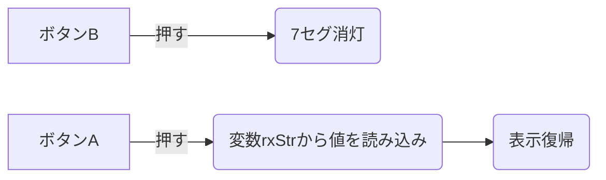
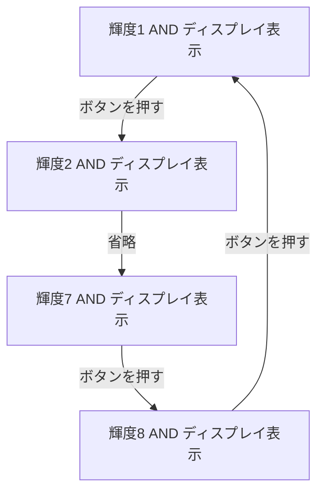

# AD7SGPRファームウェア仕様書

## 編集履歴

|日付|筆者|内容|
|---|---|---|
|23/3/6|ODA |本ドキュメント作成  |

# 概要
7セグメントLEDが8桁付いたUSB接続の機器。  
USB経由のCOMポート通信により外部ディスプレイのような振る舞いをする。  

各種PCソフトから英数字を受けて7セグへ表示するためのファームウェアを記述する。

# ハードウェア構成
- メインマイコン RP2040(.inoで記述予定)  
- 7セグコントローラ TM1638
- 8桁分の7セグメントLED カソードコモン赤
- 操作用の4つのボタン(RP2040へ接続)
- USB Type-C

詳細はハードウェアリポジトリを参照ください。

# ファームウェア機能
- COMポートより受信した英数字の表示
    - 英数字のアニメーション機能  
- 本体ボタン機能
    - ボタンA : 輝度低→中→高→低 のループ(コントローラ仕様は8段階表現可能)
    - ボタンB ： セグメントのONOFF切り替え
    - ボタンC, : アニメーション切り替え(EEPROM保存)
    - ボタンD ： 改行文字変更？(検討中(CR,LF,CR + LF))  

- ボタン状態の送信
- アニメーション設定の受付

# 機能詳細
## 値受付
文字列を受け入れ、改行文字までを変数に挿入する。  
変数に挿入されて文字を7セグに表示する。

## 消灯
ボタンBを押すと完全に7セグを消灯させる。  
ICにこの機能は存在しないため、無を送信して消去、  
ボタンAを押したら値を復帰させるファームを記述する。  

## 輝度調整
ボタンAを使用し押すたびに輝度が変わり ループする。

